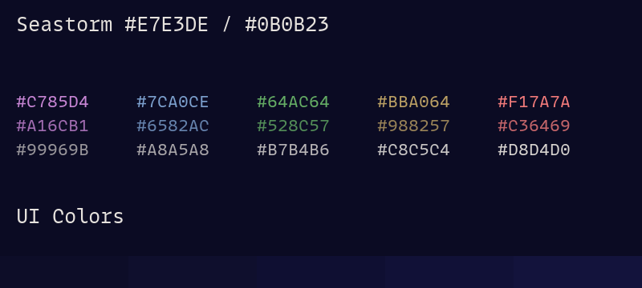

# One o Eight

Note that all main colors in all schemes have a contrast of at least 7:1 to
their background, corresponding to an AAA accessibility contrast. This doesn't
mean that the colors have strong differences from one another (most do), but
that the contrast between the colors and the background is sufficient (and
relatively homogeneous). The foreground has a 15:1 contrast to its background in
(almost) all themes.

**Note**: This is not true of the `safe` colorscheme, which is adapted from the
IBM color palette to maintain maximum color distinguishability.

## Overview of the themes

