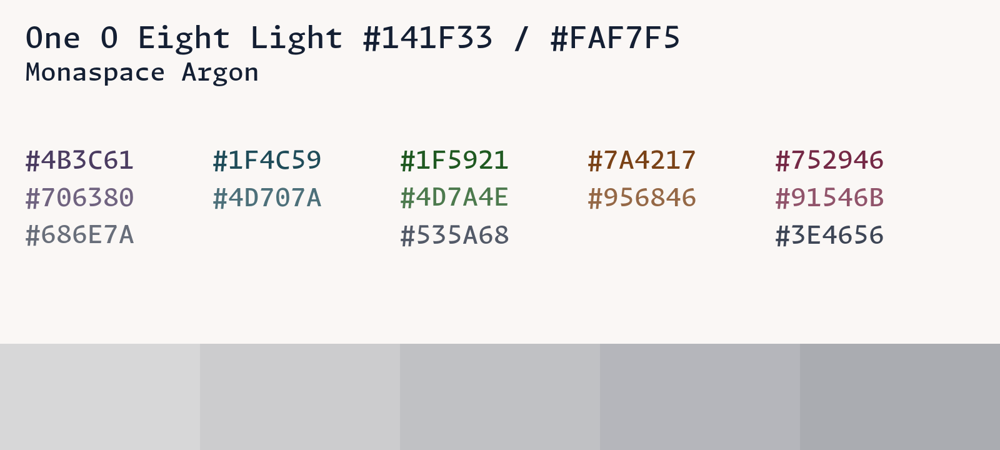
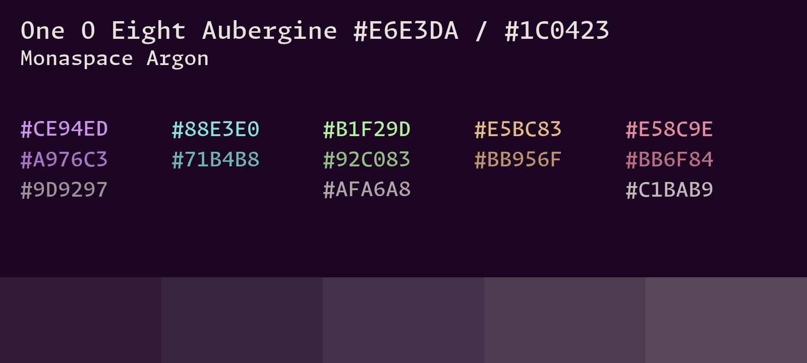

# One o Eight

The color schemes are optimized for *contrast*, meaning that the background and
foreground have a color contrast of 15, the main colors and the background have
a color contrast of 7 or more, the muted colors and the background have a color
contrast of 4.5 or more.

The cards for each theme give a list of all the main colors (top row), muted
colors (middle row), and colors of the UI elements (boxes). The cards are set in
[Monaspace](https://monaspace.githubnext.com/) 18, and each card uses a random
variant and weight of the font.

## Core themes

## Additional themes

