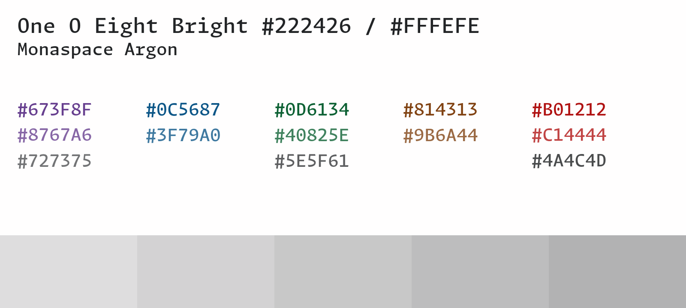
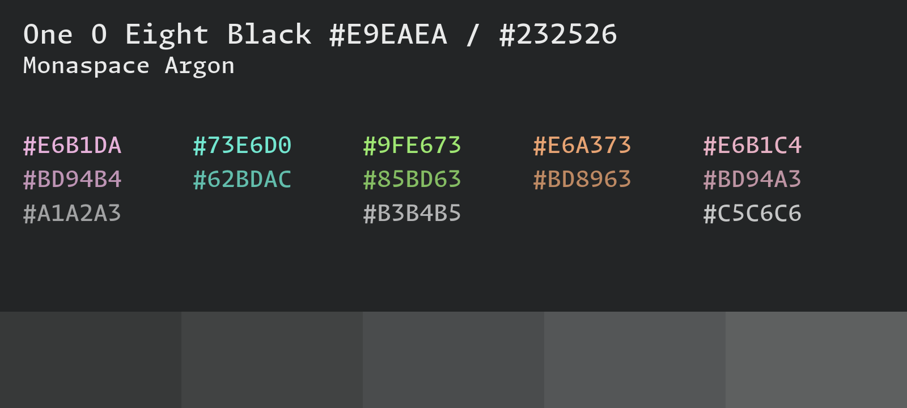

# One o Eight

The color schemes are optimized for *contrast*, meaning that the background and
foreground have a color contrast of 15, the main colors and the background have
a color contrast of 7 and more (with a few exceptions in the process of being
fixed), and the muted colors and the background have a color contrast of 4 or
more.

## Overview of the themes

